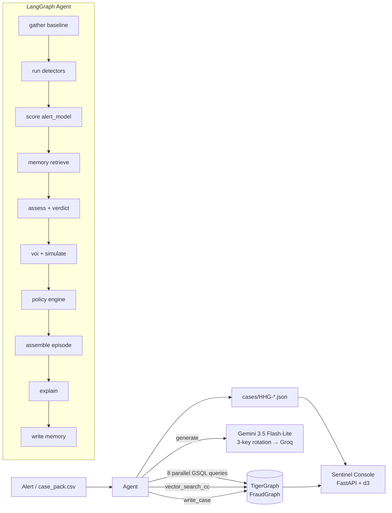

# Sentinel — Agentic Fraud Investigation on TigerGraph

**Demo video:** https://www.youtube.com/watch?v=JTeIDz8PVe8

Hackathon submission for **Hacker House Goa 2026 × TigerGraph**.

Sentinel is a LangGraph agent that reads a card-transaction graph and, for
each flagged alert, produces a verdict (fraud / legitimate / uncertain), a
fraud-pattern label, the actions the bank should take with approval routes,
and a SAR narrative when policy calls for one. Every fact in the LLM prose
has a graph query or a fitted-model coefficient behind it; every action
comes from a deterministic policy engine encoding the bank's rulebook.
The LLM writes prose. The policy engine decides. Two jobs; only one can
hallucinate, and we contained it.

## Screenshots

| Cases list | HHG-014 graph neighbourhood | Backtest report |
|---|---|---|
|  |  |  |

## Results at a glance

| Metric | Value |
|---|---|
| 20 benchmark answer files pass invariants I1–I13 | **20 / 20** |
| 20-case verdict distribution | **12 fraud / 8 legitimate / 0 uncertain** (4 SARs: HHG-004, HHG-006, HHG-011, HHG-014) |
| Alert-model 5-fold CV | **AUC 0.9465 ± 0.0046,  Brier 0.0927** |
| Simulated backtest verdict accuracy (n=150, τ=0.30, 75 tune / 75 eval) | **0.833** |
| Oracle backtest verdict accuracy (n=150) | **1.000** — see caveat† |
| **Out-of-time AUC** — model refit on Jul–Sep cases only, evaluated on all Oct+ closed cases it never saw (n=1,372: 1,228 fraud + 144 cleared) | **AUC 0.9374, Brier 0.0829** |
| FinCEN §3a policy encoding: SAR-decision replay | **4,665 / 4,665** confirmed-fraud rows (rule-encoding test) |
| Mean latency per case (shared MCP session, LLM on) | **~5 s** |
| Mean latency per case (REST fast-path, LLM off, backtest) | **2.5 s** |
| pytest suite | **129 / 129** offline (I1–I13 + query contracts + SAR replay) |
| Monitoring mode (Nov–Dec 2016 sweep, 15 alerts) | **7 fraud / 8 legitimate** in `cases_extra/` |
| SentinelCase vertices in graph | **35** (20 benchmark + 15 monitoring) |

† **Oracle caveat.** In oracle mode `customer_response` is *derived from*
the historical `actions_taken` field, which then determines the verdict
via §6 (`denied ⇒ fraud`, `confirmed ⇒ legitimate`). Oracle-mode verdict
accuracy is a policy-engine correctness check, not a model accuracy claim.
The honest end-to-end numbers are the simulated backtest and OOT AUC.

---

## Architecture



**Stack** — Python 3.11, LangGraph, custom TG 4.x JWT client + REST,
tigergraph-mcp (LangChain adapters, single long-lived stdio session),
Gemini (3 rotating keys) with Groq fallback, BAAI/bge-small-en-v1.5
embeddings (CPU, 384-dim), DuckDB feature store (read-only default so UI
+ live run + backtest coexist), scikit-learn L2 logistic, FastAPI +
vanilla-JS + d3 for the UI, pytest.

---

## How TigerGraph is used

**Schema.** 7 vertex types (`Customer`, `PaymentCard`, `Transaction`,
`DeviceProfile`, `BillingRegion`, `EmailDomain`, `ClosedCase`,
`SentinelCase`, `PolicyChunk`, `RegDocChunk`) plus directed edges. Every
`ClosedCase` carries a 384-dim `notes_embedding` used by the TigerVector
HNSW cosine index.

**18 installed GSQL queries** at `graph/queries/q01..q18_*.gsql`:

- **Baseline / typology detectors** (fired in parallel per case):
  `ring_components`, `near_threshold_burst`, `testing_sequence`,
  `burst_48h`, `recurring_match`, `device_neighbors`, `region_history`,
  `region_cluster` — 1.5–2 s wall-clock via `asyncio.gather` on
  `httpx.AsyncClient` (15× vs sequential).
- **Retrieval**: `closed_cases_touching` (structural, time-gated),
  `vector_search_cc` (TigerVector HNSW top-k over the 5,565 closed-case
  notes).
- **Graph algorithm — `ring_wcc`**: BFS-fixpoint weakly-connected
  component over the card–device projection containing a seed card,
  with a device-degree cap (default **100**) to skip hub devices.
  *Empirical note* (see `docs/LEARNINGS.md`): even at cap 100 the
  card–device projection percolates — one seed reaches ~5,500 cards
  across ~9,200 narrow devices, i.e. the giant component. WCC alone
  can't isolate a ring, so the ring evidence signal comes from
  `ring_components`' narrow-device *plus* New/proxied/confirmed-fraud
  filter, not from WCC size. `ring_wcc` still lands in the ledger as
  blast-radius context. Python wrapper: `sentinel.graph.wcc.ring_wcc`.
  Install + smoke: `python scripts/install_ring_wcc.py`.
- **Feature helpers** used by the loaders and other queries:
  `card_window`, `card_baseline_vs_txn`, `device_first_seen`,
  `proxy_device_ring`, `recipient_email_cluster`, `get_cc_embedding`.
- **Write-back**: `write_case` persists a `SentinelCase` vertex plus
  edges to card / customer / txns / devices / regions / similar-prior
  ClosedCases.

**MCP is the agent's default tool path.** `SENTINEL_GRAPH_VIA_MCP=1` is
the library default — every unset caller (investigation path,
`run_all_20.py`, ad-hoc REPL) dispatches through the `tigergraph-mcp`
stdio server via a single long-lived session shared across the whole
process (`sentinel/graph/mcp_client.py::sync_run_installed_query`, a
background asyncio loop in a daemon thread). Set the env-var to `0` to
force the REST fast-path (used by the 150-case backtest so a single
stdio subprocess doesn't serialise the whole run). See
[docs/MCP_TRANSCRIPT_HHG-014.md](docs/MCP_TRANSCRIPT_HHG-014.md) for a
per-call transcript of one investigation.

---

## GraphRAG

Every posterior is grounded in graph structure:

- Card's ±14-day window (`card_window`) → burst/sequence detectors.
- Device's `KNOWN_DEVICE` degree bucket (T1–T4) × prior-fraud
  ClosedCase → ring evidence.
- Region cluster → clone-vs-trip discrimination.
- TigerVector HNSW top-k over 5,565 `ClosedCase.notes_embedding` +
  structural `closed_cases_touching` on the same card / device /
  customer neighbourhood → similar-prior-cases retrieval.

Retrieved cases feed the LLM summary + SAR narrative. Both prompts also
carry the top-3 relevant `PolicyChunk` texts (retrieved by the same
vector index) so citations reference the actual §-numbers.

A **citation guard** (I12) sits between the LLM and the answer file:
every prompt receives an explicit whitelist of allowed case-IDs (the
case's own ID + its `similar_prior_cases`); after generation we regex
every `CC-####` and `CASE-*` token and strip any sentence citing an ID
outside the whitelist. `sentinel/policy/invariants.py::I12` enforces the
same rule on the persisted answer file.

---

## Policy as code

- 14 canonical actions with routes fixed by §2 (auto / L1 / L2).
- Rules R1–R10 in a single dispatch (`sentinel/policy/policy_engine.py`)
  with a post-process `_ensure_block_card_on_fraud` guarantee plus §3a
  FILE_REPORT + R6 MONITOR_CONNECTED_CARDS fired via `shared_element`
  or `exposure > $1,000` on `card_testing` / `undocumented`.
- **R10** gate uses `sentinel/agent/r10.py` — DISTINCT card tuples with
  `outcome=confirmed_fraud AND closed_at < opened_at`, plus this card
  if the current verdict is fraud.

**Invariants I1–I13** are enforced on every persisted answer file
(`sentinel/policy/invariants.py`):

1. `sar.file` ⇔ `FILE_REPORT` in final actions.
2. `verdict=legitimate` ⇒ empty affected txns, 0 exposure, no SAR.
3. `pattern=undocumented` ⇔ non-empty `pattern_description`.
4. `evidence_requests=[]` ⇒ `final == initial` + `what_changed=nothing`.
5. `exposure_usd == round(Σ|amt|, 2)` over `affected_txn_ids`.
6. Every ID exists in the dataset.
7. Every action's route matches §2 exactly (BLOCK_CARD re-routed by
   final exposure after episode expansion).
8. Every action's reason cites Rn or §Nx.
9. `verdict=legitimate` ⇒ `pattern=none`.
10. `BLOCK_ALL_CARDS` allowed only when `verdict=fraud` and never
    alongside `CLOSE_NO_FRAUD` (R10 surface guard).
11. `verdict=fraud ⇒ p ≥ 0.5`; `verdict=legitimate ⇒ p ≤ 0.5` (I11
    clamped in `node_assess` / `node_reassess`).
12. No invented case-IDs in `summary` / `pattern_description` /
    `sar.narrative` — every cite is in `similar_prior_cases` (the same
    list the LLM sees in its whitelist).
13. `connected_card_ids` non-empty ⇒ `shared_element` set ⇒
    (verdict fraud ⇒ FILE_REPORT + MONITOR_CONNECTED_CARDS).

**FinCEN §3a encoding replay** — every `confirmed_fraud` row in
`closed_cases_history.csv` fed through the policy engine's SAR rule
matches the historical `report_filed` field: **4,665 / 4,665**. See
`tests/test_sar_replay.py`. This is a rule-encoding test, not an
end-to-end run — the 150-case simulated backtest is the end-to-end
evaluation.

---

## Three obvious signals that weren't

**1. Risk-score decile.** The bank's model score is what the alert IS,
not evidence. Using its LR (fraud vs all negatives) let it dominate
every alerted case. Fix (`docs/DECISIONS.md`): for
`trigger_type=risk_score` the decile contributes **0 log-LR**; for
`customer_report / analyst_request` we use `lr_vs_cleared` clipped to
`|log_lr| ≤ 0.7`.

**2. Device is-new.** `id_15='New'` looks like a fraud signal until you
compute the LR: **0.671** (slightly against). Half the cleared cases
involve a new phone after travel. The alert model handles this correctly
because it was trained fraud-vs-cleared, not fraud-vs-all-negatives.

**3. High-amount purchases.** `TransactionAmt > $1,000` → LR = 0.54
(against). Big purchases skew toward legitimate in the labelled data;
we treat them as false-alarm archetype hints.

---

## Memory write-back

Every investigation persists a `SentinelCase` vertex with edges to
card, customer, txns, devices, regions, and the similar-prior
ClosedCases it retrieved. That's the memory the *next* investigation
reads. After the 20 benchmark + 15 monitoring runs there are **35
SentinelCase vertices** in the graph.

Replaying HHG-014 finds `CASE-HHG-014` in the retrieved memory hits —
the loop closes.

---

## Monitoring mode

`python -m sentinel.monitor` scans Nov–Dec 2016 transactions for
`risk_score ≥ 0.9` alerts not in the benchmark pack, dedupes, and runs
the top 15 through the same agent. LLM off, REST fast-path.
`cases_extra/*.json` + a `_index.json` for the UI's Monitor view.

An offline **undocumented-pattern sweep** (`python
scripts/undocumented_sweep.py`) scans the same window for two shapes
the five documented patterns don't cover:

- **U1**: narrow proxied device rings (KNOWN_DEVICE degree ≤ 100, ≥ 3
  distinct cards on the device in ±14 days, ≥ 1 proxied txn).
- **U2**: near-threshold bursts (≥ 3 online txns strictly below a round
  threshold within 48 hours).

Findings land in `docs/UNDOCUMENTED_FINDINGS.md` — the UI's Findings tab.

---

## How to run

```bash
# 0. Prereqs
python -V                       # 3.11
cp .env.example .env            # fill in TG_* + GOOGLE_API_KEY
pip install -e .

# 1. One-time: load the graph
python graph/load.py            # loads Transactions/Cards/Devices/Regions
python graph/install.py         # installs all 18 GSQL queries
python -m sentinel.evidence.alert_model    # fits + saves the L2 model
```

**Investigate the 20 benchmark cases** (LLM on, MCP path, writes to graph):

```bash
python scripts/run_all_20.py
# → cases/HHG-*.json + 20 SentinelCase vertices
```

**Run the 150-case simulated backtest** (LLM off, REST fast-path):

```bash
python -m sentinel backtest --n 150 --tune-frac 0.5 --mode simulated
python -m sentinel backtest --n 150 --tune-frac 0.5 --mode simulated --oot
# → backtest/predictions_*.jsonl + backtest/BACKTEST_REPORT.md
```

**Launch the analyst console** (FastAPI + d3):

```bash
./run_ui.sh                     # http://localhost:8000
```

Ten views: case list, case detail, evidence, timeline, initial-vs-final
actions with route badges + what-if toggle, SAR narrative, d3
force-layout graph neighbourhood, backtest report with reliability plot,
memory (SentinelCase count from TG), monitor (Nov–Dec sweep), findings
(undocumented U1/U2).

**What-if endpoint**: `POST /api/whatif/{case_id}` re-runs the policy
engine with a swapped customer response. Deterministic, sub-10 ms, no
LLM.

---

## Caveats

- **In-sample optimism.** The alert model is fit on the full 5,565-case
  history and the simulated backtest samples from that same pool. The
  5-fold CV numbers (AUC 0.9465, Brier 0.0927) are the honest
  generalisation estimates. The out-of-time evaluation (train Jul–Sep,
  test Oct+) is the strictest number and appears in the table above.
- **Cleared-case archetype mix.** ~80% travel; new-phone / big-purchase
  are thinner.
- **Free-tier Gemini quota** is 20/day/`gemini-3.5-flash-lite`/key;
  three rotating keys sustain the full 20-case run.

---

## Repo layout

```
sentinel/           agent + detectors + policy + evidence + retrieval
sentinel/policy/    R1–R10 engine + I1–I13 invariants
graph/queries/      18 installed GSQL queries incl. ring_wcc
graph/algorithms/   (Python wrappers around GSQL algos)
ui/backend/main.py  FastAPI (10 endpoints)
ui/frontend/        SPA (index.html / styles.css / app.js) + d3
scripts/            run_all_20.py, install_ring_wcc.py, monitor sweeps
data/raw/           closed_cases_history.csv, case_pack.csv
cases/              20 answer JSONs (I1–I13)
cases_extra/        15 monitoring answer JSONs
backtest/           BACKTEST_REPORT.md + predictions + reliability plots
docs/               ARCHITECTURE, BENCHMARK_RESULTS, DEMO_SCRIPT,
                    DECISIONS, LEARNINGS, BLOG_DEVTO,
                    MCP_TRANSCRIPT_HHG-014, UNDOCUMENTED_FINDINGS,
                    SUBMISSION
tests/              129 tests (I1–I13, query contracts, SAR replay, ask-first)
```

---

## Read next

- **[docs/SUBMISSION.md](docs/SUBMISSION.md)** — one-page reviewer's summary.
- **[docs/BENCHMARK_RESULTS.md](docs/BENCHMARK_RESULTS.md)** — 20-case
  table with per-case rationale (regenerated from each case's ledger,
  no boilerplate) and §3a justification of the 4 SARs.
- **[docs/ARCHITECTURE.md](docs/ARCHITECTURE.md)** — data plane, agent
  nodes, policy engine, alert model, UI, latency budget, tests.
- **[docs/MCP_TRANSCRIPT_HHG-014.md](docs/MCP_TRANSCRIPT_HHG-014.md)** —
  per-call MCP log of one investigation.
- **[docs/UNDOCUMENTED_FINDINGS.md](docs/UNDOCUMENTED_FINDINGS.md)** —
  U1 rings + U2 near-threshold bursts in the Nov–Dec sweep.
- **[docs/DECISIONS.md](docs/DECISIONS.md)** — every model choice with
  the surprising LR that made us reconsider.
- **[docs/LEARNINGS.md](docs/LEARNINGS.md)** — what the labels taught us
  we had wrong.
