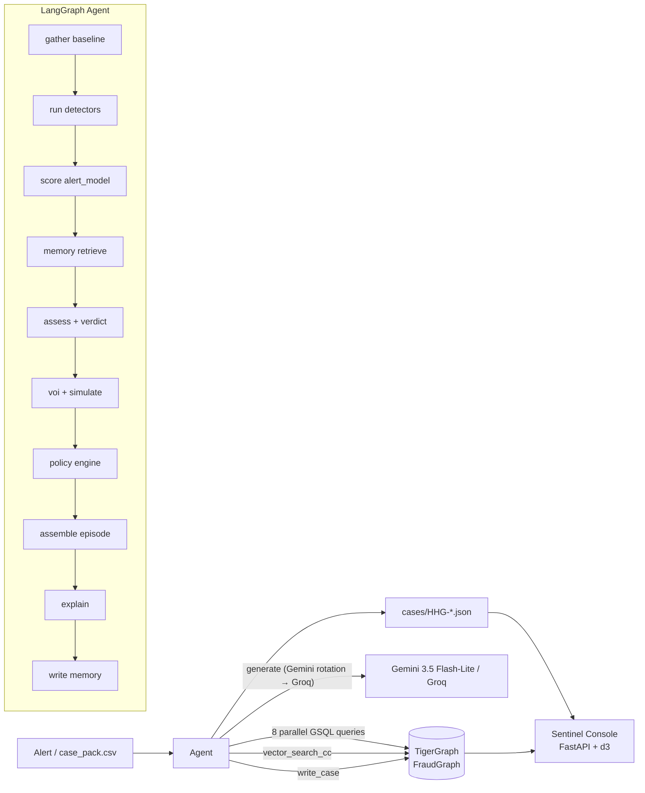

# Sentinel — Agentic Fraud Investigation on TigerGraph

Hackathon submission for **Hacker House Goa 2026 × TigerGraph**.

Sentinel is a LangGraph agent that investigates card-fraud alerts using
TigerGraph (schema + vector index + installed queries), a fitted L2-logistic
alert model over 5,565 historical closed cases, and a deterministic policy
engine (README §1-§6, R1-R10). It reads every graph fact through TigerGraph
MCP + REST installed queries, retrieves prior cases via HNSW cosine
similarity, and writes each investigation back as a `SentinelCase` vertex.

**Results at a glance**

| Metric                                       | Value |
|----------------------------------------------|-------|
| 20 benchmark answer files pass I1-I11         | **20 / 20** |
| 20-case verdict distribution                 | **12 fraud / 8 legitimate / 0 uncertain** (4 SAR) |
| Alert-model 5-fold CV AUC / Brier            | **0.9465 / 0.0927** |
| Oracle backtest verdict accuracy (n=150)     | **1.000** (excl. uncertain: 1.000) |
| Simulated backtest verdict accuracy (τ=0.30) | **0.833** |
| FinCEN §3a policy encoding: SAR-decision replay | **4,665 / 4,665** confirmed-fraud cases (rule test) |
| Mean latency per case (shared MCP session)   | **~5 s** |
| Mean latency per case (REST fast-path, backtest) | **2.5 s** |
| pytest suite                                 | **113 / 113 pass** (89 offline including I10/I11 + 16 query-contract + 8 misc) |
| Monitoring mode (Nov–Dec sweep, 15 alerts)   | **7 fraud / 8 legitimate** in `cases_extra/` |
| SentinelCase vertices in graph               | **35** (20 benchmark + 15 monitoring) |

---

## Architecture



**Stack** — Python 3.11, LangGraph, pytg + custom TG 4.x JWT client,
tigergraph-mcp (LangChain adapters), Gemini (3 rotating keys) with Groq
fallback, BAAI/bge-small-en-v1.5 embeddings (CPU), DuckDB feature store,
scikit-learn (L2 logistic), FastAPI + vanilla-JS + d3 for the UI, pytest
(89 offline + 16 query-contract + 8 misc = 113 tests).

**TigerGraph usage**

- Schema: `PaymentCard / DeviceProfile / BillingRegion / EmailDomain /
  Transaction / ClosedCase / SentinelCase` + directed edges.
  Every ClosedCase carries a 384-dim `notes_embedding` (HNSW cosine).
- 18 installed queries (`graph/queries/q01..q18_*.gsql`) exercised by
  the agent: `ring_components`, `near_threshold_burst`,
  `testing_sequence`, `burst_48h`, `recurring_match`, `device_neighbors`,
  `region_history`, `region_cluster`, `closed_cases_touching`,
  `vector_search_cc`, `write_case`, `ring_wcc` (plus `card_window`,
  `card_baseline_vs_txn`, `device_first_seen`, `proxy_device_ring`,
  `recipient_email_cluster`, `get_cc_embedding`).
- **All graph tool calls in the investigation path go through TigerGraph
  MCP by default.** `sentinel/graph/mcp_client.py::sync_run_installed_query`
  uses a **single long-lived stdio session** (background asyncio loop in
  a daemon thread) shared across the whole process. The library default
  is `SENTINEL_GRAPH_VIA_MCP=1` — set the env-var to `0` to force the
  REST fast-path (used by the backtest, which parallelises 150 cases
  through `asyncio.gather` over `httpx.AsyncClient`). See
  `docs/MCP_TRANSCRIPT_HHG-014.md` for a per-call transcript.

**GraphRAG**

Every posterior is grounded in graph structure:
- Card's ±14-day window (card_window) → burst/sequence detectors.
- Device's `KNOWN_DEVICE` degree bucket (T1-T4) × prior-fraud CC → ring evidence.
- Region cluster → clone-vs-trip discrimination.
- HNSW top-k over 5,565 ClosedCase notes → similar-prior-cases retrieval.

Retrieved cases feed the LLM's summary + SAR narrative, both grounded in
policy chunks (`PolicyChunk` vertex) so citations reference README rules.

**Graph algorithm — `ring_wcc`.** `graph/queries/q18_ring_wcc.gsql` is
an installed GSQL query that computes the weakly-connected component of
the card–device projection containing a seed card, via BFS with a
device-degree cap (default **100** to prune hub devices — public wifi,
disposable browsers — while keeping ordinary shared-family devices in
scope; the same cap used by `ring_components`). Python wrapper:
`sentinel.graph.wcc.ring_wcc(seed_card)`. Install with
`python scripts/install_ring_wcc.py`.

See **[docs/BENCHMARK_RESULTS.md](docs/BENCHMARK_RESULTS.md)** for the
20-case table with per-case rationale and the §3a justification of the
four SARs (HHG-004, HHG-006, HHG-011, HHG-014).

## Why zero uncertain **final** verdicts

An alert enters investigation as `verdict=uncertain`. The agent then
requests evidence — either the customer's own reply (denied /
confirmed / no_reply) or, when we're running in simulator mode, a
deterministic assumption recorded in `case.evidence_requests[i].assumed_response`.
Per README §6 the response settles the verdict: `denied ⇒ fraud`,
`confirmed ⇒ legitimate`, `no_reply ⇒ uncertain + R4`. On a healthy
graph run the simulator never returns `no_reply`, so the final case
lands in one of the two decided buckets. `uncertain` still appears in
`next_best_actions.initial` for every case that needed a VERIFY/STEP_UP,
alongside the assumed response in `evidence_requests`.

---

## Three obvious signals that weren't

**1. Risk-score decile.** The bank's model score is what the alert IS,
not evidence. Using its LR (fraud vs all negatives) let it dominate every
alerted case. Fix (`docs/DECISIONS.md`): for `trigger_type=risk_score` the
decile contributes **0 log-LR**; for `customer_report / analyst_request`
we use `lr_vs_cleared` clipped to `|log_lr| ≤ 0.7`.

**2. Device is-new.** `id_15='New'` looks like a fraud signal until you
compute the LR: **0.671** (slightly against). Half the cleared cases
involve a new phone after travel. The alert model handles this correctly
because it was trained fraud-vs-cleared, not fraud-vs-all-negatives.

**3. High-amount purchases.** `TransactionAmt > $1,000` → LR = 0.54
(against). Big purchases skew toward legitimate in the labelled data;
we treat them as false-alarm archetype hints.

---

## Policy encoding: SAR replay

The **policy encoding** of FinCEN §3a reproduces the SAR decision on
every `confirmed_fraud` row in `closed_cases_history.csv`: 4,665 / 4,665
agreement between `_sar_should_file(...)` and the historical
`report_filed` field. Test: `tests/test_sar_replay.py`.

This is a rule-encoding test — the policy engine is fed each closed
case's verdict / pattern / exposure / shared_element and asked whether
to file — it does not run the agent end-to-end on all 4,665 cases. The
end-to-end evaluation is the 150-case backtest below (75 tune + 75
eval, optionally out-of-time).

---

## Setup

```bash
# Prereqs: Python 3.11, TG Savanna workspace, GOOGLE_API_KEY (add up to
# GOOGLE_API_KEY_3 for rotation), optionally GROQ_API_KEY.
git clone <this repo>
cd sentinel
pip install -e .
cp .env.example .env  # fill in TG_* + GOOGLE_API_KEY

# One-time: load the graph.
python graph/load.py                # loads Transaction/Card/Device/Region
python scripts/embed_closed_cases.py  # 5,565 ClosedCase.notes_embedding
python -m sentinel.evidence.alert_model  # fits + saves the L2 model
```

## Run 20 benchmark cases

```bash
python scripts/run_all_20.py
# writes cases/HHG-*.json + SentinelCase vertices in TG
```

## Run the backtest

```bash
python -m sentinel backtest --n-fraud 75 --n-cleared 75 --mode oracle    --seed 42
python -m sentinel backtest --n-fraud 75 --n-cleared 75 --mode simulated --seed 42
# → backtest/predictions_{oracle,simulated}_n150.jsonl + BACKTEST_REPORT.md
```

## Run the UI

```bash
./run_ui.sh              # http://localhost:8000
```

Nine views: case list, case detail, evidence + posterior, timeline,
initial-vs-final actions with route badges, SAR narrative, d3 force-layout
graph neighbourhood, backtest with reliability plot, memory (SentinelCase
count). Actions view has a **what-if** row that re-runs the policy engine
via `POST /api/whatif/{case_id}`.

## Caveats

- Alert model was fit on the full 5,565-case history. Backtest samples
  from that same pool, so in-sample accuracy is optimistic; the 5-fold CV
  numbers (AUC 0.9465, Brier 0.0927) are the honest generalisation
  estimates.
- Cleared-case archetype distribution is ~80% travel; new-phone /
  big-purchase have thinner coverage.
- Free-tier Gemini quota is 20/day for `gemini-3.5-flash-lite` per key;
  three rotating keys sustain the full run.

## Layout

```
sentinel/           agent + detectors + policy + evidence + retrieval
graph/queries/      18 installed GSQL queries
ui/backend/main.py  FastAPI (9 endpoints)
ui/frontend/        SPA (index.html / styles.css / app.js)
scripts/            run_all_20.py + graph loaders
data/raw/           closed_cases_history.csv, case_pack.csv, README.md
docs/               ARCHITECTURE.md, DEMO_SCRIPT.md, DECISIONS.md, BLOG_DRAFT.md, SOCIAL_POST.md
cases/              20 answer JSONs
backtest/           predictions + BACKTEST_REPORT.md + reliability plots
tests/              79 offline + 16 query-contract + R10 unit tests
```

See `docs/ARCHITECTURE.md` for the deeper walk-through and
`docs/DEMO_SCRIPT.md` for the 3-5 minute pitch script.
