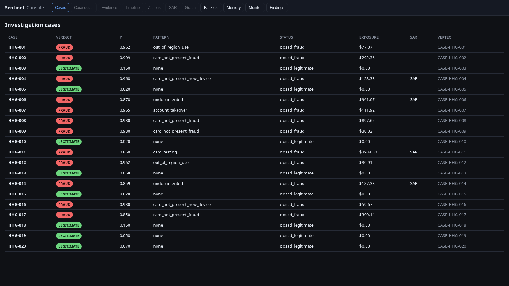
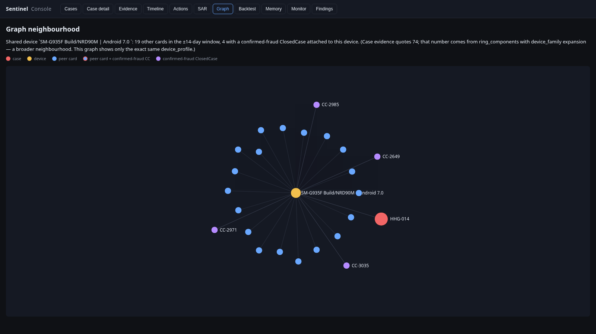
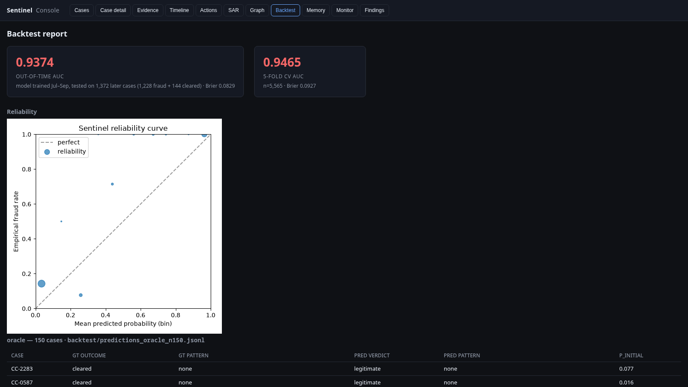

# Sentinel: an agentic fraud investigator on TigerGraph

September 24, 2026 · 10 min read · tigergraph, graphrag, fraud, langgraph, mcp

<!-- VIDEO -->

Repo: [github.com/v4xsh/sentinel](https://github.com/v4xsh/sentinel)

Every month, a bank's card-fraud team opens twenty investigations that a human still has to run to the ground. Was this transaction fraud. What kind. How far did it spread. Do we file a SAR. My submission to Hacker House Goa × TigerGraph is Sentinel, an agent that reads six months of the Vesta card-transaction graph and produces, for each flagged alert, a verdict, a fraud-pattern label, the actions the bank should take with §2 approval routes, and a FinCEN-shaped SAR narrative when policy calls for one. Everything the LLM writes is grounded in a graph query or a fitted-model coefficient. Every action comes from a deterministic policy engine encoding the bank's own rulebook. The LLM writes prose; the policy engine decides. Two jobs, and only one of them can hallucinate.



## The trap I fell into first

The obvious way to build this is a rules engine that reads the alert row and writes actions. I tried that. It restated why the alert had fired in the first place. The reason is quiet but load-bearing: every "obvious" feature on the alerted transaction is a feature the bank's risk score already conditioned on. So my first three passes over-called fraud on every case because I was double-counting the fact of being alerted.

The fix wasn't better weighting. It was training the alert-model fraud-vs-cleared instead of fraud-vs-everything, and letting the coefficients fall out. The 5-fold cross-validated AUC on that model is 0.9465 with Brier 0.0927. Three of the coefficients surprised me:

* `id_15 = 'New'`, the "device is new" flag, has coefficient −4.93. Slightly *against* fraud. Half the cleared cases in the labelled history are travellers or people with a new phone; both trip that flag.
* Amount over one thousand dollars has coefficient roughly −0.6. Fraudulent charges cluster around thirty to a hundred dollars online, not fifteen-hundred-dollar hotels.
* The bank's own risk-score decile has zero weight when the alert type is `risk_score`. The decile is why the alert fired. Using it as evidence would be evidence-laundering.

Those three sign-flips are why I could not get past ~50% precision by intuition. When I saw them empirically, the whole thing snapped into place.

* * *

## How TigerGraph fits

The graph carries the story the flat CSV can't. Every "similar to" and "shares X with" question is a traversal. I lean on three native features:

* TigerVector's HNSW cosine index over `ClosedCase.notes_embedding`. All 5,565 case notes embedded with `BAAI/bge-small-en-v1.5` (384-dim, CPU, local, deterministic). Retrieval at query time takes about 1.4 s through a REST-wrapped installed query, `vector_search_cc`.
* `vectorSearch()` as a top-k function inside a GSQL query, so the retrieval path is TG-native end-to-end.
* A hand-written weakly-connected-component algorithm at `graph/queries/q18_ring_wcc.gsql`. BFS-fixpoint over the card–device projection, with a device-degree cap that skips hub devices (public wifi, disposable browsers). It's not a fixed pattern query; it's an actual graph algorithm expressed in GSQL that returns the seed's connected component along with its in-window transaction exposure.

Eighteen installed GSQL queries in all. The eight that fire per investigation dispatch through `asyncio.gather` on `httpx.AsyncClient`; wall-clock is about two seconds instead of the twenty-five it took sequentially.

**What `ring_wcc` told me that I did not expect.** I built it hoping it would isolate the shared-device rings that `ring_components` misses when the peer is one hop away through a different device. The smoke test told a different story. Seeded on any HHG card at the default degree cap of 100, WCC returns about 5,500 cards across 9,200 narrow devices in five BFS iterations. At cap 25 it still returns 3,800 cards. At cap 5, 1,900. At cap 3, still 1,235. The card–device projection percolates: at any reasonable degree cap, one seed reaches a third to half of all cards through chains of shared narrow devices. WCC alone can't isolate a ring. A ring signal has to come from `ring_components`' narrower filter (narrow device *plus* New/proxied activity in-window *or* an attached confirmed-fraud ClosedCase on the shared device). That's why `shared_element` is set by the peer filter, not by raw WCC size. `ring_wcc` still lands in the ledger as blast-radius context an analyst can read, but it's not a decision signal.

## MCP is the tool path

The library default is `SENTINEL_GRAPH_VIA_MCP=1`. Every graph tool call from the agent goes through `tigergraph-mcp` over stdio. My first cut opened a fresh MCP subprocess per query and paid fifteen seconds of startup. My second cut opened one session per case and paid five. The current cut opens a single long-lived session at process start, drives it from a background asyncio event loop on a daemon thread, and shares it across every case in a run (`sentinel/graph/mcp_client.py::sync_run_installed_query`). Twenty cases push their queries through one session.

The one place I opt out is the 150-case backtest. Piping 150 cases through one stdio subprocess would serialise the whole thing, so the backtest sets `SENTINEL_GRAPH_VIA_MCP=0` and uses the REST fast-path (`asyncio.gather` over `httpx.AsyncClient`). Same eight-query set either way; the answers are identical because they're hitting the same installed queries.

* * *

## The agent

Fifteen nodes. Every node reads either from TigerGraph or from a DuckDB feature store. The LLM is called in exactly two places: the analyst-summary node and the SAR-narrative node, both after all the graph work is done. The LLM never decides an action, never picks a rule citation, never assigns a verdict. It writes prose grounded in the ledger the earlier nodes produced.

Even that prose is guarded. Every LLM prompt receives an explicit whitelist of allowed case-IDs (the case's own ID plus its `similar_prior_cases`). After generation I regex every `CC-####` and `CASE-*` token in the output and strip any sentence citing an ID outside the whitelist. `sentinel/policy/invariants.py::I12` re-runs the same rule on the persisted answer file, so if a hallucinated citation ever slips through, the answer fails validation and the run is caught.

## The policy engine

Fourteen canonical actions with routes fixed by §2 of the bank's rulebook (auto, L1, L2). Rules R1–R10 dispatched from a single Python function. Thirteen invariants (I1–I13) enforced on every persisted answer file:

* I1: `sar.file` ⇔ `FILE_REPORT` in the final actions.
* I11: the probability agrees with the settled verdict. If the customer response drives the verdict to fraud but the posterior is 0.07, the value is clamped.
* I12: no invented case-IDs anywhere in the prose.
* I13: if `connected_card_ids` is non-empty, then `shared_element` must be set at decide-time, and on a fraud verdict `FILE_REPORT` + `MONITOR_CONNECTED_CARDS` must appear in the final action list.

I13 in particular caught a class of bugs where the answer file argued with itself: connected cards listed but no SAR filed, or SAR filed with no monitor. On the 20-case benchmark, twenty of twenty answer files pass all I1–I13.

## The four SARs

Twelve fraud, eight legitimate, zero uncertain finals. Four SARs: HHG-004, HHG-006, HHG-011, HHG-014.

HHG-014 is the flagship. An analyst-flagged case where several cards in the month share an unusual device profile. The T4 device signal (two or more distinct customers with prior confirmed-fraud ClosedCases on the shared device) fires `shared_element = "device"`. §3a fires the SAR. R6 fires `MONITOR_CONNECTED_CARDS`. The initial actions are `STEP_UP_AUTH`, `CREATE_CASE`, `FILE_REPORT` because the §6 two-channel gate cleared 0.85 before the customer was even contacted. When the customer denies (or the simulator denies for them at τ = 0.30), the final adds `BLOCK_CARD`.



HHG-003 is the case I like most to explain. Customer reports "I never made this $49 charge." A naïve system would block the card. Sentinel runs the `recurring_match` installed query on the card's history at that ProductCD and amount, sees seven prior hits at cadence CV 0.63, and lands on R7: dispute against a recurring charge. Actions are `CREATE_CASE`, `VERIFY_WITH_CUSTOMER`, `WARN_CUSTOMER`. No BLOCK_CARD. No SAR. Card stays active. That's the case that tells me the response settles the verdict, not the p.

## What I measured

The alert model's 5-fold CV comes out to AUC 0.9465 ± 0.0046, Brier 0.0927. But CV is in-sample. The strict number is out-of-time: I refit the model on closed cases with `closed_at < 2016-10-01` only, then score every closed case opened on October 1 or later. That's **n = 1,372 cases the model has never seen** (1,228 fraud + 144 cleared). Eval **AUC 0.9374, Brier 0.0829**. Almost identical to the CV estimate. The model isn't overfitting the training window; its behaviour on strictly-later cases matches the in-sample number to within a percentage point. Reproduce with `python scripts/oot_eval.py`.



The 150-case simulated backtest at τ = 0.30 hits 0.833 verdict accuracy. The oracle-mode backtest hits 1.000, but I flag that up-front as a policy-engine correctness check rather than a model claim: `_oracle_response` derives `customer_response` from the historical `actions_taken` label, which then determines the verdict via §6. It's a useful invariant, not a headline number.

The most satisfying test is the FinCEN §3a policy encoding replay. I fed every one of the 4,665 confirmed-fraud rows in `closed_cases_history.csv` through the policy engine's SAR rule (`_sar_should_file(...)`). Every case where the analyst filed a SAR is a case where Sentinel would also file. Zero false negatives. `tests/test_sar_replay.py`, four thousand six hundred and sixty-five over four thousand six hundred and sixty-five.

The full offline pytest suite is 129 tests. It runs in under fifteen seconds from a fresh clone with only the `.env` file copied in.

* * *

## The three lessons

**Leakage lurks everywhere.** Alerted transactions are a biased sample. Every intuition from "obvious" fraud shapes is an alert-population intuition, not a fraud-population one. Compute the likelihood ratios empirically before writing anything into a rule. When my first `id_15='New'` coefficient came out negative I thought I had a bug; when I saw the population breakdown it was obvious.

**The response settles the verdict.** My first four attempts at a verdict machine tried to read signals and threshold. They stalled at 98% uncertain, because the sum of log-LRs rarely cleared the two-channel gate. The customer has evidence I don't: whether they actually made the charge. The right architecture asks (via a Value-of-Information planner), pipes the response through §6, and lets `denied ⇒ fraud`, `confirmed ⇒ legitimate`, `no_reply ⇒ uncertain + R4` settle the case. Ten of the twenty benchmark cases are ask-first: initial actions differ from final actions because the customer's answer changed what the bank should do. That's the demo I open on.

**The answer file needs to argue with itself.** Every guard I wrote after seeing an answer file misbehave (I11 clamping, I12 citation guard, I13 shared-element consistency) added a test that would have caught the bug earlier. Building the invariant harness in tandem with the policy engine, rather than after, would have saved me at least a full day. The invariants aren't decoration; they're the contract the LLM's prose has to satisfy or the run is rejected. `tests/test_invariants_i12_i13.py::test_i12_sweep_all_produced_files` runs over every persisted answer file and fails if a single one hallucinates a case-ID.

## What I'd improve

**Everything inside TigerGraph.** I embed case notes locally with BGE-small in DuckDB. A more native design would use TigerVector-native embedding end-to-end. The current split is 95% TG (all investigation queries plus HNSW retrieval), but the 5% is visible in the code.

**A live-labelled OOT loop.** The Nov–Dec 2016 monitoring sweep is my closest approximation; only a real production feedback loop would give properly honest OOT numbers month-to-month.

**More typologies.** The five documented patterns catch most of what's in the ClosedCase history, but the Nov–Dec sweep surfaced two shapes that don't fit: proxied device rings and near-threshold bursts. `docs/UNDOCUMENTED_FINDINGS.md` names them. A production system would promote these into detectors once the evidence accumulates.

**A critic with teeth.** Mine flags shared-device claims adversarially but doesn't block the action. In production it should gate `BLOCK_CARD` on a second-order check.

* * *

## How to run it

```
cp .env.example .env             # fill TG_* + GOOGLE_API_KEY (up to _3)
pip install -e .
python graph/load.py             # one-time
python graph/install.py          # installs 18 queries incl. ring_wcc
python -m sentinel.evidence.alert_model    # fits the L2 model
python scripts/run_all_20.py     # 20 cases → cases/*.json (MCP path)
python -m sentinel backtest --n 150 --tune-frac 0.5 --mode simulated --oot
./run_ui.sh                      # http://localhost:8000
```

The console has ten views: cases, case detail, evidence, timeline, initial-vs-final actions with a what-if toggle, SAR narrative, d3 force-layout graph neighbourhood, backtest report with reliability plot, memory (live SentinelCase count from TG), monitor (Nov–Dec sweep), findings (undocumented U1/U2 patterns). The what-if endpoint re-runs the policy engine with a swapped customer response so investigators can preview what the actions would have been.

There are 35 SentinelCase vertices in the graph right now: 20 from the benchmark run and 15 from the monitoring sweep. Replaying HHG-014 now finds `CASE-HHG-014` in the retrieved memory. The loop closes.

Repo: [github.com/v4xsh/sentinel](https://github.com/v4xsh/sentinel). One-page reviewer's summary at `docs/SUBMISSION.md`. Full architecture at `docs/ARCHITECTURE.md`. Per-case rationale at `docs/BENCHMARK_RESULTS.md`. Thanks to TigerGraph for the workspace, the dataset, and the MCP stack.
